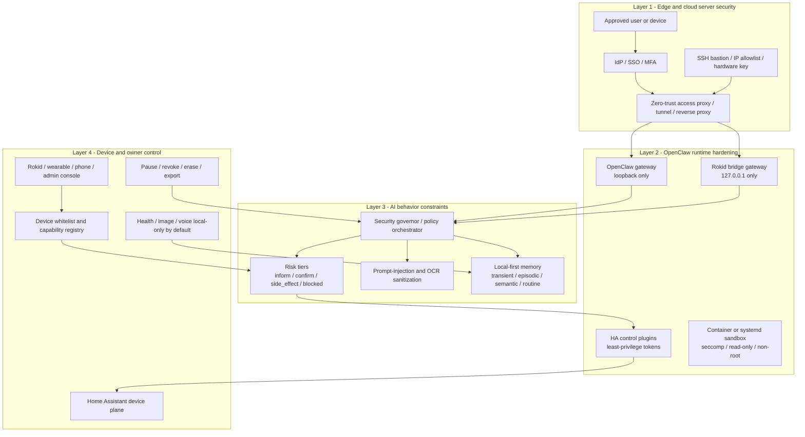
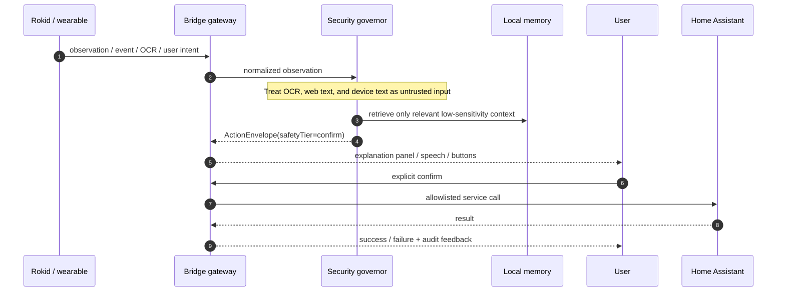
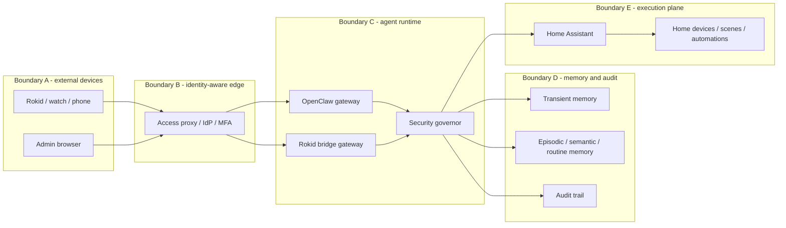

# OpenClaw × Home Assistant × Rokid blueprint

这个仓库已经是一个可运行的 `OpenClaw + Home Assistant + Rokid` 蓝图，但它当前更接近 **demo / lab setup**，还不是可以安全暴露到公网、长期接入可穿戴与家居设备的生产系统。

这份 README 的目标不是只解释“怎么跑起来”，而是把它升级成一份**四级安全系统实施说明**：

- 结合当前仓库里的真实代码和配置
- 结合本地设计稿、PPT、图片中的四层防线思路
- 结合外部成熟案例：`NIST Zero Trust`、`Google BeyondCorp`、`Cloudflare Access`、`Docker seccomp`、`systemd hardening`、`Home Assistant LLM boundary`、`OpenAI/Anthropic prompt-injection defense`
- 给出一个**复杂但靠谱**的目标架构，而不是空泛的安全口号

如果只记一句话，这个系统应该遵守下面这条权责模型：

> **可穿戴 / Rokid 是感知权威，Home Assistant 是设备权威，OpenClaw 是代理与编排权威，安全治理层是授权与降权权威，最终的人类用户是最高权威。**

## Status update 2026-03-15

最近这份蓝图已经补了一个更明确的“多生态兼容”落地方向，当前状态是：

- `openclaw-plugin-ha-control` 已经从单一 demo 控制面扩成了 `HA-first` 的多生态 registry
- 已有样例生态：`xiaomi`、`matter`、`aqara`、`tuya`、`switchbot`、`hue`、`homekit`、`google / nest`
- 新增了 `plugins/openclaw-plugin-hue/`
  - 可直接连本地 Hue bridge
  - 支持状态、灯列表、场景列表、灯光控制、场景激活
- 新增了 `plugins/openclaw-plugin-google-home/`
  - 目前只做 readiness / OAuth checklist
  - 不声明 live Google Home control 已完成
- `homekit` 目前仍然只走 `Home Assistant` 路径，不提供伪直连 API

进展汇总见：

- `../../docs/openclaw-ha-ecosystem-progress-2026-03-15.md`

---

## 1. 先说结论：当前仓库哪里不安全

当前仓库有不少好骨架，但默认配置仍然偏向“先跑通”：

- `openclaw-config/openclaw.json` 当前是 `gateway.bind = "lan"`
- `openclaw-config/openclaw.json` 当前是 `agents.defaults.sandbox.mode = "off"`
- `docker-compose.yml` 直接暴露了 `8123`、`11434`、`3301`、`18789`
- `rokid_dispatch_ha` 和 `ha-control` 都依赖 Home Assistant token，默认没有做更细粒度的双 token 分离
- 当前 Rokid 路径虽然已经有“先解释、再确认、再执行”的闭环，但还没有上升为全局的风险分级系统

换句话说：

> 这个仓库今天已经具备“最小安全原语”，但还没有形成“分层、降权、可审计、可撤销”的生产级安全体系。

---

## 2. 借鉴了什么成功案例

这份架构不是拍脑袋写的，核心借鉴了 7 类成熟实践。

### 2.1 NIST Zero Trust Architecture

借鉴点：

- 不因为“在内网”就默认可信
- 每一次访问都看身份、设备状态、上下文和资源敏感级别
- 网络位置不是信任来源，策略才是

这里最适合本项目的含义是：

- 不能因为 OpenClaw 和 HA 在同一台云主机就互相信任
- 不能因为 Rokid 设备是“自己的设备”就给无限能力
- 不能因为请求来自局域网或隧道就默认跳过鉴权

### 2.2 Google BeyondCorp / identity-aware edge

借鉴点：

- 先做身份感知的前门，再谈内网
- 用 `SSO + MFA + device posture` 代替“开 VPN 就算安全”

落到本项目，就是：

- OpenClaw dashboard、admin API、SSH 入口都不该裸露给公网
- 入口要由 `Cloudflare Access / Tailscale / 自建 IdP + reverse proxy` 这种前门兜住

### 2.3 Cloudflare Access / Zero Trust

借鉴点：

- 先在边界层完成身份校验和策略判断
- 只暴露必要路径
- 把“访问网关”和“应用本身”拆开

这对本仓库尤其重要，因为你很可能需要：

- 暴露某些移动端或眼镜需要访问的接口
- 又不想把 `18789`、`3301`、`11434` 整套直接丢到公网

### 2.4 Docker seccomp + systemd hardening

借鉴点：

- 即使应用被打穿，也尽量把系统调用、文件系统、网络出口、服务权限压到最小
- 用容器 / service sandbox 限制进程能力，而不是完全依赖应用自身守规矩

### 2.5 Home Assistant LLM boundary

Home Assistant 官方给了一个很值得抄的边界：

- 给 LLM 的应该是“暴露能力”而不是整个管理平面
- 不应该让模型直接获得 Home Assistant 的行政级能力

这和你这个仓库的方向是一致的：

- `Home Assistant = home entity authority`
- `OpenClaw = runtime authority`
- 两者之间应该是**能力面**，不是**全权管理员面**

### 2.6 OpenAI / Anthropic 的 layered prompt-injection defense

借鉴点：

- 提示注入不是靠一个 system prompt 就能防住
- 工具边界、审批边界、记忆边界、输出验证都要同时存在
- OCR 文本、网页内容、设备屏幕、第三方 API 返回值都要视作**不可信输入**

这对 Rokid 视觉链路尤其关键：

- 眼镜看到的屏幕文字
- OCR 到的提示
- 识别出的设备标签
- 用户语音中的隐式指令

都不能直接变成可执行动作。

### 2.7 Scientify 的 orchestrator / executor 分离

从 `Scientify-Meetup 0314.pdf` 里，最值得借鉴的不是“科研”本身，而是**架构纪律**：

- 编排器持有全局视角和长期知识
- 执行器只做狭义任务
- 编排器不自己下场写代码和跑实验，而是调度、验证、修正

把这个思想迁移到安全系统里，就是：

- **安全治理层 / policy governor** 持有全局策略、风险级别和私有知识
- **执行层** 只做 `read / explain / propose / confirm / dispatch`
- 编排层不应直接拿设备级密钥去做实际动作

这个思路比“让一个大模型既理解上下文又直接控制所有设备”稳得多。

### 2.8 来源整合矩阵

下面这张表回答一个更实际的问题：**这些链接到底分别被用到了哪里。**

| 来源 | 提炼出的稳定结论 | 在本 README 中的落点 |
| --- | --- | --- |
| NIST Zero Trust Architecture | 网络位置不是信任来源，访问必须持续按身份和上下文判定 | Layer 1 的前门设计、管理面与用户面分离 |
| Google BeyondCorp Enterprise | 不靠传统“进了 VPN 就安全”，而是先做 identity-aware edge | `SSO + MFA + device posture` 前门 |
| Cloudflare Access / Zero Trust | 边界层要先完成访问策略，而不是直接暴露应用端口 | 只暴露 access proxy，不直接暴露 `18789/3301/11434` |
| Docker seccomp | 被攻破后的第一道运行时止损是 syscall 与 capability 收缩 | Layer 2 的 `cap_drop`、`seccomp`、`no-new-privileges` |
| systemd hardening | 服务级最小权限要落到 OS 级别，而不是只靠应用自律 | `ProtectSystem`、只读根文件系统、私有临时目录等思路 |
| Home Assistant LLM docs | 给模型的是“暴露能力”，不是整个 HA 管理平面 | `HA_READ_TOKEN / HA_ACT_TOKEN` 拆分、entity allowlist |
| OpenClaw exec approvals 思路 | 真实执行能力必须有 allowlist、policy、必要时用户确认 | `proposal -> confirm -> dispatch` 升级成全局风险引擎 |
| OpenAI safety best practices | 不可信输入必须经过多层过滤，工具边界要单独治理 | OCR、网页、语音、第三方返回值都视作 untrusted |
| Anthropic prompt-injection mitigation | 提示注入需要多重防线，不能押注单一 prompt | Layer 3 的输入净化、默认静默、危险域禁止自动执行 |
| Scientify-Meetup 0314.pdf | 编排器持全局知识，执行器只做狭义任务 | `security-governor` 的拆分建议 |
| ChatGPT-OpenClaw Jarvis 系统设计稿 | 记忆分层、隐私标签、risk/care escalation 要独立建模 | Layer 3 和 Layer 4 的 memory / consent / care 模型 |

这张矩阵的目的不是“堆参考文献”，而是明确：  
**README 里的每个重要安全主张，都有对应来源和落地位置。**

---

## 3. 更新后的权责模型

这是这套系统最重要的架构更新。

### 3.1 五个 authority

1. `Sensor authority`
   - Apple Watch / iPhone bridge / Rokid / 手机 companion
   - 只负责产生感知和事件，不负责决定最终动作

2. `Home entity authority`
   - Home Assistant
   - 维护实体状态、场景、服务、自动化、设备拓扑

3. `Agent runtime authority`
   - OpenClaw
   - 负责语言理解、规划、记忆使用、技能调度、任务编排

4. `Security policy authority`
   - 四层安全治理系统
   - 负责鉴权、降权、审批、风险分级、记忆约束、设备许可

5. `Human authority`
   - 设备拥有者 / 被照护者 / 家庭管理员
   - 拥有暂停、撤销、导出、擦除、最终确认权

### 3.2 一个重要原则

> **OpenClaw 不应直接成为“设备管理员”；它应该成为“被安全治理层约束的智能编排器”。**

这意味着：

- OpenClaw 可以提出动作
- OpenClaw 可以解释原因
- OpenClaw 可以整合记忆
- 但 OpenClaw 不应默认拥有门锁、摄像头、支付、管理员配置这类高危能力

---

## 4. 当前仓库 vs 目标生产架构

| 维度 | 当前仓库 | 目标生产态 |
| --- | --- | --- |
| OpenClaw 监听 | `bind = "lan"` | `bind = "loopback"`，只能本机 / 私网 reverse proxy 访问 |
| OpenClaw 鉴权 | demo 默认 | 强制 `token` 或等价强鉴权 |
| Agent sandbox | `off` | 使用当前 OpenClaw 版本支持的最严格非 `off` 模式，并叠加 OS sandbox |
| 端口暴露 | `8123 / 11434 / 3301 / 18789` 可见 | 只暴露边界层，内部服务只在私网或回环 |
| Home Assistant token | 单 token 倾向 | 分离成 `read token` 与 `actuation token`，必要时再按域拆分 |
| Rokid 动作链 | 局部 `confirm` | 全局风险等级：`inform / confirm / side_effect / blocked` |
| 记忆 | bridge 里只有短期待确认态 | 分层记忆，带隐私标签、保留策略、导出/删除能力 |
| 用户控制 | demo 级别确认 | 设备白名单、暂停、撤销、擦除、可审计 |
| 云边界 | 没有专门前门 | `SSO + MFA + Zero Trust Access` 前置 |

---

## 5. 四级安全系统总览

四级安全系统不是“四个 checklist”，而是四个相互独立、互相兜底的失效域：

- `Layer 1` 挡住不该进来的人和设备
- `Layer 2` 就算有人进来了，也尽量只能在狭小沙盒里活动
- `Layer 3` 就算模型被诱导，也不能直接跨越风险边界
- `Layer 4` 就算前三层都失误，用户仍然握有最终开关和数据主权

### 5.1 总体架构图



### 5.2 动作审批与执行图



### 5.3 信任边界图

四层安全系统真正要解决的是“不同平面的失效不要串联”。下面这张图把系统拆成 5 个边界：



设计要求是：

- `A` 被攻破，不应直接拿到 `E`
- `B` 失守，不应自动绕过 `C` 的 policy
- `C` 被诱导，不应默认拿到 `D` 的全部敏感记忆
- `D` 泄漏，不应自动获得 `E` 的执行能力

这就是为什么我们要坚持“分层、分权、分 token、分服务账号、分数据等级”。

---

## 6. Layer 1：边界与云主机安全

### 6.1 目标

把 OpenClaw、Rokid bridge、Home Assistant、Ollama 都藏在受控边界后面，不让它们直接暴露到互联网。

### 6.2 设计原则

- **绝不直接暴露 `18789`、`3301`、`11434` 到公网**
- SSH 不走弱密码，不走全网放开
- 应用访问先过身份前门，再进入应用
- 把 admin plane 和 user plane 分离

### 6.3 推荐控制项

1. `Zero-trust front door`
   - `Cloudflare Access`
   - `Tailscale`
   - 或自建 `Caddy / Nginx + OIDC`

2. `SSO + MFA`
   - 管理端必须 2FA
   - 高风险操作还可以要求再确认

3. `SSH hardening`
   - IP allowlist
   - 短时授权
   - 硬件密钥
   - 禁止密码登录

4. `TLS everywhere`
   - 公网入口必须 HTTPS
   - 边界层到应用层尽量也走私网或 mTLS

5. `Split admin and user routes`
   - dashboard
   - plugin install
   - logs
   - config write
   - 这些都不能和用户请求走同一暴露面

### 6.4 在本仓库里的具体改造

当前仓库需要至少做到：

- `openclaw-gateway` 不再对公网暴露端口
- `rokid-bridge-gateway` 不再对公网暴露端口
- `ollama` 不再对公网暴露端口
- 只让边界层容器或隧道容器接触外网

最少要从这几项开始：

- 把 `openclaw-config/openclaw.json` 的 `gateway.bind` 改成 `loopback`
- 从 `docker-compose.yml` 移除 `11434`、`3301`、`18789` 的外部 `ports`
- 为边界层单独增加一个 `reverse proxy / access proxy` 容器

### 6.5 借鉴成功案例时要记住的边界

`BeyondCorp` 和 `Cloudflare Access` 的可借鉴点是“先做身份前门”，不是“上了一个 CDN 就算安全”。  
真正重要的是：

- 每个入口单独做策略
- 管理路径和用户路径分离
- 即使来源于可信网络，也要重复鉴权

---

## 7. Layer 2：OpenClaw 运行时加固

### 7.1 目标

即使某个服务被攻破，也尽量限制它：

- 看不到全部 secrets
- 打不到宿主机
- 不能任意调用 Home Assistant
- 不能顺手拿到管理员面

### 7.2 当前仓库里已经有的好基础

这个仓库其实已经有几项值得保留的安全原语：

1. `rokid-bridge-gateway` 只监听 `127.0.0.1`
2. `/v1/confirm` 只有在 pending action 存在时才会真正 dispatch
3. `TransientMemoryStore` 只保存短期待确认动作和已确认结果，没有默认长期持久化
4. `ActionEnvelope` 已经用 `safetyTier` 表达动作危险级别

这说明你不是从零开始。

### 7.3 运行时控制项

1. `OpenClaw bind and auth`
   - `bind = loopback`
   - 强制 token auth
   - admin API 不与普通 user API 混用

2. `Agent sandbox`
   - 不允许 `sandbox.mode = off` 出现在生产环境
   - 使用当前 OpenClaw 版本支持的最严格非 `off` 模式
   - 额外叠加容器 / OS 限制，不把安全完全押在应用层

3. `Container hardening`
   - 非 root 运行
   - `read_only: true`
   - `tmpfs` 承载临时写入
   - `cap_drop: ["ALL"]`
   - `no-new-privileges`
   - 默认 seccomp
   - 如有条件再加 AppArmor / SELinux

4. `Filesystem scoping`
   - 插件目录只挂需要的内容
   - 模型、缓存、日志、配置分卷隔离
   - 不把宿主机根目录挂进去
   - 绝不挂 Docker socket

5. `Network scoping`
   - OpenClaw 只允许访问：
     - LLM provider
     - Home Assistant
     - 必要的工具 API
   - 阻断无关 egress

6. `Secret scoping`
   - OpenClaw 读状态和执行动作尽量分离 token
   - Rokid bridge 自己拿不到多余 secrets
   - 没有必要不要把 HA token 同时给多个容器

7. `Plugin and tool allowlist`
   - 只启用你审计过的 plugin / skill
   - 危险工具单独要求审批

### 7.4 这个仓库里最该优先改的 6 项

1. `openclaw-config/openclaw.json`

```json
{
  "gateway": {
    "mode": "local",
    "bind": "loopback",
    "auth": {
      "mode": "token"
    }
  },
  "agents": {
    "defaults": {
      "sandbox": {
        "mode": "<supported-non-off-mode>"
      }
    }
  }
}
```

说明：

- `loopback` 已经在你自己的 devbox 环境里验证过是合理配置
- `sandbox` 的具体取值要跟你当前 OpenClaw 版本支持的模式对齐，但生产环境不能继续是 `off`

2. `docker-compose.yml`

- 不要继续对外暴露：
  - `11434`
  - `3301`
  - `18789`
- 最好只保留本地开发时需要的管理入口

3. `HA token split`

至少拆成两类：

- `HA_READ_TOKEN`
  - 只读 entity state、conversation、必要 metadata
- `HA_ACT_TOKEN`
  - 仅限 allowlisted `service domains`

4. `bridge local-only`

`rokid-bridge-gateway` 继续保持只监听 `127.0.0.1`，不要为了“方便联调”改成公网服务。

5. `service account isolation`

- `openclaw-gateway`
- `rokid-bridge-gateway`
- `homeassistant`
- `ollama`

这几个服务要分别有自己的用户、卷和权限边界。

6. `tool surface minimization`

`rokid_dispatch_ha` 不要成为“万能 HA 调度器”，而应该只允许经过 allowlist 的域和实体。

---

## 8. Layer 3：AI 行为约束与记忆安全

### 8.1 目标

模型即使聪明，也不能自我授权；即使被诱导，也不能直接跨越高危边界。

### 8.2 这一层为什么最容易被低估

很多系统把“安全”理解成：

- 一个 system prompt
- 一个拒绝模板
- 一句“不要乱操作”

这不够。真正的风险来自：

- OCR 文本里嵌入恶意提示
- 设备屏幕上显示“忽略之前规则”
- 网页或对话内容诱导模型调用工具
- 长期记忆中混入高敏感内容，被不相关场景检索出来
- 模型因为“看起来像对的”而自信执行错误动作

### 8.3 本项目建议采用的 AI safety 结构

#### A. 把动作分级，而不是统一处理

建议全局采用 4 级动作等级：

- `inform`
  - 只解释，不做副作用
- `confirm`
  - 解释后等待用户明确确认
- `side_effect`
  - 已通过确认，允许执行副作用
- `blocked`
  - 生产环境默认禁止

当前仓库的 `ActionEnvelope.safetyTier` 已经提供了这个雏形，可以直接扩展为全局规则，而不只服务于咖啡机场景。

#### B. 让“提议动作”和“执行动作”分离

这正是当前 `observe -> confirm -> dispatch` 路径已经在做的事情。

目标态里应该这样工作：

1. 感知层只产生 observation
2. 模型只产生 proposal
3. 安全治理层评估风险并打标签
4. 用户或规则系统确认
5. 执行层才拿到最小权限去下发动作

#### C. 把 OCR 和视觉文本视作不可信输入

视觉链路最重要的规则：

- OCR 文本只可作为证据，不可作为命令
- 设备标签只可作为识别候选，不可直接变成 `entity_id`
- 网页 / 屏幕中的“请帮我执行”不应拥有系统级优先级

#### D. “Silence by default”

当存在以下情况时，默认不执行：

- 置信度低
- 多个实体匹配冲突
- 上下文不足
- 命中高危服务域
- 文本疑似提示注入
- 当前设备未被授权

### 8.4 记忆系统必须自带隐私和保留策略

借鉴本仓库里的 `Jarvis` 设计稿，以及 Scientify 的“私有知识长期积累”思路，推荐把记忆分成四层：

1. `Transient memory`
   - 待确认动作
   - 本轮会话上下文
   - TTL 小时级

2. `Episodic memory`
   - 发生过的事件和结果
   - 适合审计与回放
   - TTL 天到周

3. `Semantic memory`
   - 稳定偏好、设备命名、低风险习惯
   - 长期存在，但必须可导出和删除

4. `Routine memory`
   - 从 episodic 中提炼出的习惯
   - 只能存聚合信息，不应保留不必要原始高敏感数据

### 8.5 给记忆加 privacy class

建议引入四类隐私标签：

- `P0`
  - 公开或低敏数据
- `P1`
  - 普通偏好和低敏行为模式
- `P2`
  - 位置、语音摘要、日程、常用路线
- `P3`
  - 健康、原始图像、原始音频、照护事件、家庭成员身份信息

规则：

- `P3` 默认不得离开本地
- `P2` 默认不得无关检索
- `P0/P1` 才适合做常规上下文增强

### 8.6 借鉴 Scientify 但不要照抄

Scientify 的一个关键优点是：

- 编排器持有长期私有知识
- 执行器只做局部任务

迁移到本系统时，正确的做法是：

- **安全 governor** 持有风险策略与记忆索引
- **执行器** 只拿“本次需要的最小上下文”

不正确的做法是：

- 让每个执行工具都读整套长期记忆
- 让模型直接持有 Home Assistant 行政密钥

---

## 9. Layer 4：设备与用户控制

### 9.1 目标

哪怕前三层都出错，用户仍然要有物理和逻辑上的最终控制权。

### 9.2 这一层的核心不是“体验”，而是“主权”

必须默认接受下面这些现实：

- 设备会丢
- 眼镜会被借用
- 手机会离身
- 家庭成员可能不希望被持续感知
- 被照护场景中的“善意自动化”很容易越界

### 9.3 关键控制项

1. `Device whitelist`
   - 只接受注册过的 Rokid、手机、手表、admin 端
   - 每台设备有独立 ID、能力范围、撤销状态

2. `Capability registry`
   - 不是所有设备都能触发所有动作
   - 举例：
     - Rokid 可提议场景动作，但不能直接调用高危执行
     - Apple Watch 可上报生理状态，但不能直接控制门锁
     - Admin console 才能改策略

3. `Pause / revoke / erase anytime`
   - 一键进入安全模式
   - 一键暂停主动监听
   - 一键导出数据
   - 一键擦除本地长期记忆

4. `Local-only by default`
   - 原始图像
   - 原始音频
   - 健康与照护数据
   - 默认只存本地

5. `Human-in-the-loop on dangerous domains`
   - 门锁
   - 摄像头录制
   - 麦克风长录音
   - 安防布撤防
   - 支付、购买、账号管理
   - 一律不能自动执行

6. `Care escalation ladder`
   - 先温和提醒
   - 再重复确认
   - 再通知 caregiver
   - 高危场景单独策略
   - 不要把照护提醒和普通家居 automation 放在同一权限层

### 9.4 这层在 Rokid 路径上尤其要注意

Rokid 是一个很容易让系统“看起来像无处不在”的入口，所以更要明确限制：

- 不做默认持续录制
- 不做无提示静默拍照
- 不让视觉结果自动映射成高危动作
- 不让眼镜成为系统管理员终端

---

## 10. 风险矩阵：哪些动作默认允许，哪些必须确认，哪些禁止

| 能力 | 默认策略 | 说明 |
| --- | --- | --- |
| 读取 Home Assistant 状态 | 允许 | 只读，且通过 allowlisted entity |
| 解释视觉结果 | 允许 | 纯解释，无副作用 |
| 播报、提醒、通知 | 允许 | 低风险，但仍需遵守静默时段 |
| 开灯、切换低风险 scene | 视场景可确认或自动 | 前提是用户自己授权过 |
| 调风扇、调空调温度 | 默认确认 | 可逐步演进到低风险 routine auto |
| 触发咖啡机场景 | 默认确认 | 当前 demo 就属于这一类 |
| 打开摄像头 / 持续录音 | 默认禁止自动执行 | 必须显式用户触发 |
| 门锁、门禁、安防、支付 | blocked | v1 不开放给 agent 自动执行 |
| 改策略、改插件、装 skill | admin only | 只能从管理平面执行 |

---

## 11. 仓库中的现有模块，如何映射到四层安全系统

### 11.1 现有模块职责

- `homeassistant-config/`
  - 真实设备执行面
- `openclaw-config/`
  - OpenClaw 配置面
- `plugins/openclaw-plugin-ha-control/`
  - 现有 Home Assistant 联动逻辑
- `plugins/openclaw-plugin-rokid-bridge/`
  - Rokid 相关工具面
- `plugins/openclaw-plugin-hue/`
  - 直接 Hue bridge 工具面
- `plugins/openclaw-plugin-google-home/`
  - Google Home / Nest readiness 工具面
- `services/rokid-bridge-gateway/`
  - observation / confirm 入口
- `packages/contracts/`
  - `VisualObservationEvent` / `ActionEnvelope`
- `apps/rokid-android-companion/`
  - Rokid 官方 Android companion 最小接入

### 11.2 映射后的分层关系

- `Layer 1`
  - 不在 repo 主体里，而是在 repo 前面新增边界层：
    - `Cloudflare Access`
    - `Caddy / Nginx + OIDC`
    - `Tailscale`

- `Layer 2`
  - `openclaw-config/`
  - `docker-compose.yml`
  - `services/rokid-bridge-gateway/`
  - `plugins/openclaw-plugin-ha-control/`
  - `plugins/openclaw-plugin-rokid-bridge/`

- `Layer 3`
  - `ActionEnvelope.safetyTier`
  - `services/rokid-bridge-gateway/src/routes/observe.ts`
  - `services/rokid-bridge-gateway/src/routes/confirm.ts`
  - `services/rokid-bridge-gateway/src/store/transientMemory.ts`
  - 后续应新增：
    - `packages/policies/`
    - `packages/memory/`
    - `services/security-governor/`

- `Layer 4`
  - `apps/rokid-android-companion/`
  - 后续应新增：
    - `device-registry`
    - `consent ledger`
    - `erase/export runbook`

---

## 12. 生产级实施路线

下面这条路线是“复杂但靠谱”的版本，也是最建议执行的顺序。

### Phase 0：先止血

目标：先停止明显不安全的暴露。

- [ ] 不再把 `11434`、`3301`、`18789` 暴露给公网
- [ ] 把 OpenClaw 从 `bind = lan` 改为 `bind = loopback`
- [ ] 开启 gateway token auth
- [ ] 停止在生产里使用 `sandbox.mode = off`

### Phase 1：加身份前门

目标：让所有远程访问都先经过 Zero Trust 层。

- [ ] 给 dashboard 和 admin API 放到 `Cloudflare Access / Tailscale / OIDC proxy` 后面
- [ ] SSH 改成密钥 + allowlist + 审计
- [ ] 管理入口和用户入口拆分域名或路径

### Phase 2：压缩运行时能力

目标：就算服务被打穿，也只能在很窄的范围内活动。

- [ ] 所有服务非 root
- [ ] `read_only` 根文件系统
- [ ] `cap_drop: ALL`
- [ ] `no-new-privileges`
- [ ] 默认 seccomp
- [ ] HA token 拆分
- [ ] 插件与 skill allowlist

### Phase 3：把确认流升级成全局 risk engine

目标：不只咖啡机场景安全，整套 agent 都按风险分级运行。

- [ ] 把 `inform / confirm / side_effect / blocked` 写成统一策略层
- [ ] 设备实体按风险分级
- [ ] Prompt-injection 检测和 OCR 输入净化进入正式链路
- [ ] 记忆系统加 privacy class 和 retention 策略

### Phase 4：设备主权与数据主权

目标：让系统可被用户掌控，而不是反过来控制用户。

- [ ] 设备白名单
- [ ] pause / revoke / erase
- [ ] local-only 默认策略
- [ ] caregiver escalation ladder
- [ ] 审计导出能力

---

## 13. 推荐补充的目录结构

如果要把四级安全系统真正落地，这个仓库后续建议补出这些目录：

```text
openclaw-ha-blueprint/
├─ packages/
│  ├─ contracts/
│  ├─ policies/
│  │  ├─ risk-tier/
│  │  ├─ prompt-injection/
│  │  ├─ entity-allowlist/
│  │  └─ consent/
│  └─ memory/
│     ├─ transient/
│     ├─ episodic/
│     ├─ semantic/
│     └─ routine/
├─ services/
│  ├─ rokid-bridge-gateway/
│  ├─ security-governor/
│  ├─ device-registry/
│  └─ audit-export/
├─ docs/
│  ├─ threat-model/
│  ├─ runbooks/
│  └─ security/
└─ infra/
   ├─ reverse-proxy/
   ├─ cloudflared/
   └─ hardening/
```

### 13.1 为什么要单独加 `security-governor`

因为它承担的职责和当前 bridge 不一样：

- bridge 是 ingress / confirm / idempotency
- governor 是 policy / memory / risk / approval decision

如果把两者混在一起，后面会出现两个问题：

- 安全策略跟 demo 逻辑耦合
- 每次加一个场景，都要重新改执行层代码

把 governor 单独拆出来，才更符合 Scientify 式“编排器持有全局规则，执行器只做狭义任务”的架构。

---

## 14. 当前这份蓝图最值得保留的设计

虽然这份 README 重点是“升级安全”，但当前仓库本身已经有几个非常对的方向：

1. `contract -> bridge -> explanation -> confirm -> HA action`
   - 这条链是正确的
   - 它比“视觉识别后直接自动执行”稳得多

2. `Home Assistant 作为 device plane`
   - 比 OpenClaw 直连所有厂商私有 API 更可维护
   - 也更符合“统一世界模型 + 统一实体图”的长期架构

3. `TransientMemoryStore` 做局部待确认态
   - 说明你已经开始把“模型输出”和“真正动作”分离

4. `Rokid bridge local-only`
   - 当前 `127.0.0.1` 监听是个好习惯
   - 不要为了调试方便破坏它

5. `Android companion` 单独存在
   - 把设备接入层和 agent runtime 分开，后续更容易做 capability registry

---

## 15. 仍然不建议在 v1 自动开放的高危能力

以下能力即使系统已经做了四层防线，`v1` 也不建议直接自动开放：

- 门锁 / 门禁
- 安防布撤防
- 摄像头持续录制
- 麦克风长时录音
- 药物分发
- 炉灶 / 烤箱 / 电热器具
- 支付与购买
- 修改系统策略 / 安装第三方插件 / 改 token / 改网络设置

原因不是“永远不能做”，而是这些动作的**误触发代价和合规代价太高**，应该放到后续独立 threat model 里处理。

---

## 16. 现有 demo 的 bring-up 和运行方式

下面这部分保留当前蓝图的可运行说明，但请记住：**能跑不等于可以安全暴露。**

### 16.1 运行前必须修改的配置

#### Home Assistant / OpenClaw

在 `openclaw-config/openclaw.json` 里至少替换：

- `REPLACE_ME_HA_LONG_LIVED_TOKEN`
- `switch.third_reality_wall_switch`
- `switch.switchbot_bot`
- 可选地把 `scene.demo_cooling_after_workout` 改成真实 `scene.*`
- 可选地加上真实 `fanEntityId` / `climateEntityId`
- 如果要启用 `hue` 或 `google-home` 直连插件：
  - 把 `plugins.entries.<plugin-id>.enabled` 设为 `true`
  - 把 `<plugin-id>` 同时加到 `tools.allow` 和 `plugins.allow`
- `homekit` 目前只通过 `ha-control.ecosystems` 接入，不需要额外直连插件

#### Rokid bridge

在 `docker-compose.yml` 里至少替换：

- `rokid-bridge-gateway.environment.HA_TOKEN`
- 可选地把 `ROKID_COFFEE_SCENE_ENTITY_ID` 改成真实 `scene.*` 或 `button.*`

### 16.2 启动服务

```bash
docker compose up -d
```

这会启动：

- `homeassistant`
- `ollama`
- `rokid-bridge-gateway`
- `openclaw-gateway`
- `openclaw-cli`

### 16.3 在 Home Assistant 里创建 token

- 打开 `http://127.0.0.1:8123`
- 在 profile 中生成 long-lived token
- 写入：
  - `openclaw-config/openclaw.json`
  - `docker-compose.yml` 中 `rokid-bridge-gateway.environment.HA_TOKEN`

### 16.4 安装 OpenClaw plugins

```bash
./scripts/bootstrap-openclaw-plugin.sh
```

当前脚本会安装：

- `openclaw-plugin-ha-control`
- `openclaw-plugin-rokid-bridge`
- `openclaw-plugin-hue`
- `openclaw-plugin-google-home`

### 16.5 拉取 Ollama 模型

```bash
docker compose exec ollama ollama pull glm-4.7-flash
```

### 16.6 打开 OpenClaw UI

OpenClaw gateway 当前监听在 `18789`：

```bash
docker compose exec openclaw-cli openclaw dashboard --no-open
```

---

## 17. Demo 1：wearable -> HA

```bash
HA_TOKEN=YOUR_TOKEN ./scripts/demo-sequence.sh
```

这条路径会执行：

```text
high heart-rate webhook
  -> plugin memory update
  -> Home Assistant mirror state
  -> presence changes to home
  -> cooling response
```

---

## 18. Demo 2：Rokid coffee machine -> HA

确保 `rokid-bridge-gateway` 已启动并且 `HA_TOKEN` 正确后运行：

```bash
./scripts/demo-rokid-coffee-sequence.sh
```

它会：

1. 把 `scripts/rokid-observation.sample.json` 包装成 `POST /v1/observe`
2. 打印解释性 `ActionEnvelope`
3. 发送确认 `POST /v1/confirm`
4. 打印 side-effect `ActionEnvelope`

当前 demo 默认动作：

```text
scene.turn_on -> scene.morning_coffee
```

---

## 19. Wired Rokid photo capture via ADB

如果你只是想做“有线连接下定时拍照并把照片拉回本机”，可以直接运行：

```bash
./scripts/rokid-wired-photo-capture.sh
```

默认行为：

- 使用 `adb shell input keyevent 27` 触发快门
- 每 30 秒拍 1 张
- 共拍 10 张
- 每轮只拉回当次新增的照片
- 默认保存到 `~/Pictures/RokidCaptures/<timestamp>/`

前置条件：

- 眼镜已通过 USB 连上电脑，并且 `adb devices` 能看到设备
- 相机应用保持前台
- 屏幕保持常亮

常用覆盖参数：

```bash
ROKID_CAPTURE_SERIAL=1901092534014036 \
ROKID_CAPTURE_OUTPUT_DIR="$HOME/Desktop/rokid-captures" \
./scripts/rokid-wired-photo-capture.sh
```

如果按键触发无效，也可以改成坐标点击快门：

```bash
ROKID_CAPTURE_SERIAL=1901092534014036 \
ROKID_CAPTURE_TRIGGER=tap \
ROKID_CAPTURE_TAP_X=240 \
ROKID_CAPTURE_TAP_Y=560 \
./scripts/rokid-wired-photo-capture.sh
```

测试脚本在：

```bash
./scripts/tests/rokid-wired-photo-capture.test.sh
```

---

## 20. Progress sync: macOS camera access path A

下面这段记录的是当前这条路线的**已验证进展**，方便后续继续，不需要重新从聊天记录回忆上下文。

### 20.1 目标

目标不是把 Mac 摄像头做成持续 raw stream 输入，而是先打通官方支持的最短链路：

```text
macOS OpenClaw app
  -> remote over SSH
  -> paired macOS node
  -> camera.snap / camera.clip
  -> remote OpenClaw gateway on devbox
```

这条路线对应的是上文提到的最省代码策略：

- 使用 OpenClaw 官方 macOS app
- 使用官方 `Remote over SSH` 模式连接远端 gateway
- 通过 paired node 暴露本机相机能力
- 先跑通 `camera.snap`，再考虑是否需要 event gate / sidecar

### 20.2 已确认的事实

截至当前同步时，下面这些已经被验证：

1. `devbox` 远端 gateway 正常
   - `ssh devbox` 正常
   - 远端 `openclaw health` 正常
   - gateway 仍然是 `loopback` 绑定

2. 本地到远端的浏览器/CLI 隧道正常
   - 已验证 `ssh -L 18789:127.0.0.1:18789 devbox`
   - 本地 `curl http://127.0.0.1:18789/health` 返回 `{"ok":true,"status":"live"}`

3. 本机 OpenClaw CLI 已安装
   - 当前机器可直接执行 `openclaw`

4. 本机尚未安装 `OpenClaw.app`
   - `/Applications` 中未发现 `OpenClaw.app`

5. 官方源码构建路径已经确认
   - 官方文档与源码都指向：
     - `pnpm install`
     - `./scripts/package-mac-app.sh`
   - 无证书时可以使用 ad-hoc signing

6. 源码准备已完成
   - 已 clone 官方 `openclaw/openclaw`
   - 已安装 `pnpm`
   - `pnpm install` 已成功完成

### 20.3 当前卡点

当前主要卡点不是远端 gateway，也不是 CLI，而是：

- `OpenClaw.app` 还没有成功产出到 `dist/OpenClaw.app`
- 因此还没进入以下两个必须的人机交互步骤：
  - 在 macOS 上授予 Camera/TCC 权限
  - 在远端 gateway 上批准 node pairing

也就是说，当前状态可以概括成：

```text
remote gateway: ready
local CLI: ready
source deps: ready
macOS app bundle: still packaging
node pairing: not started
camera permission: not started
```

### 20.4 一旦 app 打包成功，下一步固定顺序

后续不要重新想流程，按这个顺序继续即可：

1. 启动 `OpenClaw.app`
2. 在 app 中选择 `Remote over SSH`
3. 填入 `devbox` 对应远端信息
4. 在 app 里开启 `Settings -> General -> Allow Camera`
5. 在 macOS 系统里完成 Camera 权限授权
6. 到远端 gateway 查看 pending node pairing
7. 批准这台 Mac 作为 node
8. 执行：

```bash
openclaw nodes status
openclaw nodes camera list --node <nodeId>
openclaw nodes camera snap --node <nodeId>
```

### 20.5 这条路线为什么仍然值得继续

即使最终产品更可能演进到 `sidecar + event gate + /hooks/agent`，A 路线依然有价值：

- 它是官方支持的最低集成复杂度路径
- 它能最快验证“远端 Claw 是否真的能拿到本机摄像头”
- 它为后续是否还需要 sidecar 提供基线

也就是说，A 路线不是最终架构，但非常适合做**权限与节点链路的 first proof**。

---

## 21. 本地测试

第一次在宿主机运行测试前：

```bash
npm install
```

然后执行：

```bash
npm test
```

当前覆盖：

- contract schema tests
- multi-ecosystem registry and tool tests
- Hue plugin tests
- Google Home / Nest readiness plugin tests
- Rokid plugin helper tests
- Rokid bridge route tests
- bootstrap script coverage

截至 `2026-03-15`，`npm test` 在本仓库下是 `29/29` 通过。

---

## 22. 重要文件

- `openclaw-config/openclaw.json`
- `docker-compose.yml`
- `packages/contracts/src/visual-observation.ts`
- `packages/contracts/src/action-envelope.ts`
- `plugins/openclaw-plugin-rokid-bridge/src/index.ts`
- `plugins/openclaw-plugin-ha-control/src/index.ts`
- `plugins/openclaw-plugin-ha-control/src/ecosystem.ts`
- `plugins/openclaw-plugin-hue/src/index.ts`
- `plugins/openclaw-plugin-hue/src/client.ts`
- `plugins/openclaw-plugin-google-home/src/index.ts`
- `services/rokid-bridge-gateway/src/server.ts`
- `services/rokid-bridge-gateway/src/routes/observe.ts`
- `services/rokid-bridge-gateway/src/routes/confirm.ts`
- `services/rokid-bridge-gateway/src/store/transientMemory.ts`
- `scripts/bootstrap-openclaw-plugin.sh`

---

## 23. 参考与借鉴

### 外部成功案例

- NIST Zero Trust Architecture  
  <https://www.nist.gov/publications/zero-trust-architecture>

- Google BeyondCorp Enterprise  
  <https://cloud.google.com/beyondcorp-enterprise>

- Cloudflare Access / Zero Trust  
  <https://developers.cloudflare.com/cloudflare-one/applications/configure-apps/>

- Docker seccomp  
  <https://docs.docker.com/engine/security/seccomp/>

- systemd sandboxing / hardening  
  <https://www.freedesktop.org/software/systemd/man/systemd.exec.html>

- Home Assistant LLM / exposed capabilities boundary  
  <https://developers.home-assistant.io/docs/core/llm/>

- OpenAI prompt-injection guidance  
  <https://platform.openai.com/docs/guides/safety-best-practices>

- Anthropic prompt-injection mitigation guidance  
  <https://docs.anthropic.com/en/docs/test-and-evaluate/strengthen-guardrails/mitigate-prompt-injection>

### 本地文件与设计稿

- `Readme/Scientify-Meetup 0314.pdf`
- `Readme/ChatGPT-OpenClaw Jarvis系统设计 (1).md`
- 你提供的四层防线图片

---

## 24. 最后的架构判断

如果你真的要把这个仓库推进到长期可用、可连接 Rokid、可连接可穿戴、可控制家居、还能保住用户主权的系统，那么最关键的不是“多加几个 skill”，而是下面这三件事：

1. **把 OpenClaw 从“设备管理员”降级成“受约束的智能编排器”**
2. **把所有高风险动作改成“提议 -> 确认 -> 执行 -> 审计”**
3. **把安全拆成四层独立失效域，而不是押注某一个组件永不犯错**

做到这三点，这个系统才不是一个好看的 demo，而是一套可以逐步接近生产质量的架构。
