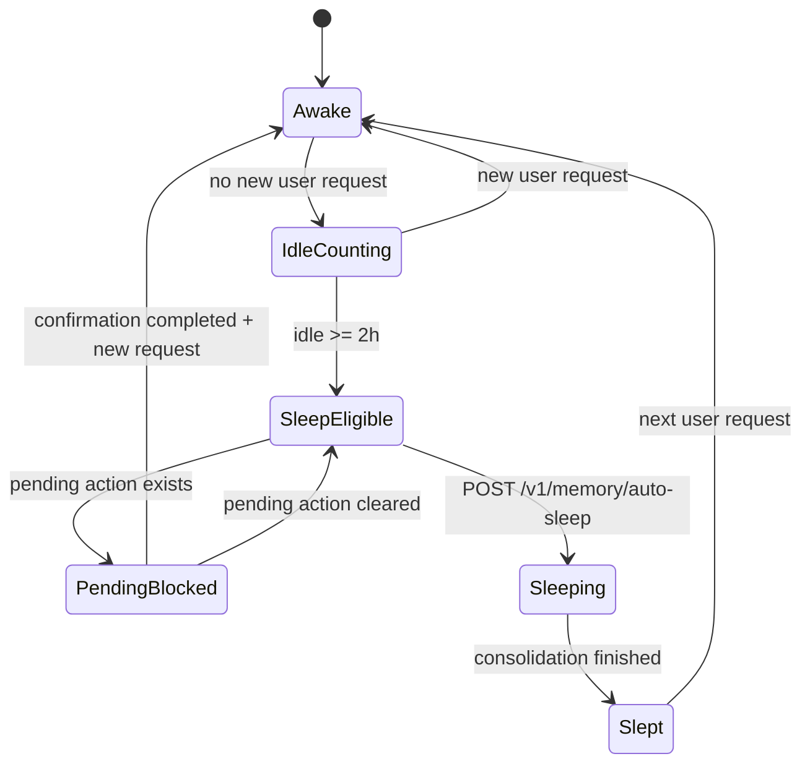

# Mira Memory Sleep And Forgetting Spec

## File Relationship

- Chinese source: `mira-memory-sleep-and-forgetting-spec.md`
- English companion: `mira-memory-sleep-and-forgetting-spec.en.md`

This file is the English companion to the current memory sleep-and-forgetting spec. The Chinese source remains the canonical working note in this repo; this file is intended for bilingual maintenance and later release-facing reuse.

## 1. Goal

This spec defines the current `sleep` and `forgetting` mechanisms in Mira's memory system.

The goal is not to “delete chat history on a timer.” The goal is to establish a layered memory lifecycle that:

- preserves recent context with higher fidelity
- keeps only high-signal facts in long-term memory
- gradually forgets low-value ambient noise
- treats sleep as an auditable consolidation boundary

The current implementation is local-first and primarily lives inside the `rokid-bridge-gateway` memory pipeline under:

- `OpenClaw/devbox/project/openclaw-ha-blueprint-memory/`

## 2. Design Principles

### 2.1 Local-First

- raw events, long-term facts, and runtime state stay in local SQLite
- sleep consolidation does not depend on a remote state service
- highly sensitive data should not leave the local machine by default

### 2.2 Two-Phase Memory Processing

The design follows a two-phase flow:

1. write events during runtime
2. consolidate later during idle-time sleep

This is safer and easier to audit than promoting long-term memory while the live interaction is still unfolding.

### 2.3 Selective Forgetting

Forgetting is selective, not random. It should remove:

- same-day low-change ambient idle noise
- low-importance environmental observations that remain unused across days
- records that should never be promoted into long-term facts

### 2.4 User-Inactivity Trigger

Sleep is triggered by user inactivity, not by a fixed clock time.

The default condition is:

- no user request to Claw for more than `2 hours`

## 3. Current Implementation Directory

```text
OpenClaw/devbox/project/openclaw-ha-blueprint-memory/
├─ services/
│  └─ rokid-bridge-gateway/
│     └─ src/
│        ├─ memory/
│        ├─ routes/
│        ├─ store/
│        └─ server.ts
├─ scripts/
│  └─ run-memory-idle-sleep-check.sh
└─ docs/
   └─ superpowers/
      └─ plans/
```

### 3.1 Responsibility Split

- `memoryLedger.ts`
  - unified interface for events, long-term facts, and runtime state
- `sqliteMemoryLedger.ts`
  - SQLite-backed implementation
- `memoryRuntimeState.ts`
  - runtime lifecycle fields such as the last user request and the last sleep batch
- `memorySleepConsolidator.ts`
  - daily consolidation, importance scoring, fact promotion, and forgetting
- `memoryIdleSleepController.ts`
  - idle-threshold checks, sleep triggering, and blocking rules
- `memoryIngest.ts`
  - event-ingest entry point and user-request detection
- `memoryAutoSleep.ts`
  - auto-sleep HTTP route
- `transientMemory.ts`
  - pending and confirmed action state used to block sleep when needed
- `server.ts`
  - runtime route wiring and request-touch logic
- `run-memory-idle-sleep-check.sh`
  - scheduler-facing trigger script

## 4. Memory Layers

### 4.1 Working / Transient Memory

Role:

- keep the latest conversation and pending actions
- support immediate context and interaction continuity

Sources:

- `memory_events`
- `TransientMemoryStore`

Properties:

- highly time-sensitive
- not equal to long-term memory
- pending actions block auto-sleep

### 4.2 Episodic Memory

Role:

- record what happened
- support audit, replay, and later consolidation

Source:

- `memory_events`

Properties:

- can be compressed during sleep
- can be marked with `forgotten_at`

### 4.3 Long-Term Facts

Role:

- keep stable preferences, explicit instructions, and durable facts

Source:

- `memory_long_term_facts`

Properties:

- only high-signal content is promoted
- promotion happens during sleep consolidation

### 4.4 Runtime State

Role:

- record the last user request
- record the last sleep execution status
- prevent repeated sleep on the same silent window

Source:

- `memory_runtime_state`

## 5. State Machine



### 5.1 State Semantics

- `Awake`
  - recent user request exists; the system is still in an active interaction period
- `IdleCounting`
  - no new request has arrived; idle time is accumulating
- `SleepEligible`
  - idle duration has reached the threshold
- `PendingBlocked`
  - a pending action or confirmation blocks sleep
- `Sleeping`
  - consolidation and forgetting are running
- `Slept`
  - the latest request window has already been processed once

## 6. Table Structure

### 6.1 `memory_events`

Purpose:

- store event-level memory
- support context retrieval
- provide input for sleep consolidation

Key fields include:

- `event_id`
- `event_type`
- `source_type`
- `source_event_id`
- `session_id`
- `actor_id`
- `target_id`
- `occurred_at`
- `ingested_at`
- `modality`
- `scope`
- `payload_json`
- `dedupe_key`
- `privacy_level`
- `salience_hint`
- `retention_class`
- `importance_score`
- `consolidated_at`
- `consolidation_batch_id`
- `forgotten_at`

### 6.2 `memory_long_term_facts`

Purpose:

- store long-term facts and stable preferences

Key fields include:

- `fact_key`
- `content`
- `score`
- `privacy_level`
- `source_event_id`
- `updated_at`

### 6.3 `memory_runtime_state`

Purpose:

- store idle and sleep lifecycle state

Key fields include:

- `singleton_key`
- `last_user_request_at`
- `last_sleep_started_at`
- `last_sleep_completed_at`
- `last_sleep_triggered_for_request_at`
- `last_sleep_batch_id`

## 7. Trigger Conditions

### 7.1 What Counts As A User Request

The current implementation updates `last_user_request_at` for:

1. `POST /v1/observe`
   - using `observation.observedAt`
2. `POST /v1/confirm`
   - using the current server timestamp
3. `POST /v1/memory/events`
   - when `eventType === "chat.user_message"` or `sourceType === "chat"`

The following do not count as user requests:

- ambient observe
- periodic polling
- heartbeat-style background work
- internal consolidation only

### 7.2 Sleep Trigger

Default condition:

- `now - last_user_request_at >= 2 hours`

Current default threshold:

- `MIRA_MEMORY_IDLE_THRESHOLD_SECONDS=7200`

### 7.3 Skip Conditions

`POST /v1/memory/auto-sleep` skips when any of the following applies:

- `no_user_request`
- `pending_confirmation`
- `idle_threshold_not_met`
- `already_slept_for_latest_request`

### 7.4 Forgetting Trigger

Current forgetting rules mark these classes during sleep:

1. same-day low-value ambient idle noise
2. multi-day low-importance ambient observations

The implemented signals include:

- `event_type === "ambient.observe"`
- low `changeScore`
- low `importanceScore`
- age-based thresholds

## 8. Sleep Consolidation Rules

### 8.1 Importance Scoring

Current scoring logic increases or decreases importance based on:

- `candidate_long_term`
- `chat.user_message`
- `ambient.observe`
- `scope === "ambient"`
- preference-like phrases such as `remember`, `like`, `dislike`, `do not`, and similar cues

### 8.2 Long-Term Promotion

An event is promoted only when:

- text exists
- `importanceScore >= 0.7`
- it is a candidate long-term record or contains explicit preference / remember intent

### 8.3 Sleep Output

Each sleep writes two classes of outputs:

1. `workspace/memory/YYYY-MM-DD.md`
   - daily consolidation summary
   - kept memories
   - forgotten memories
   - promoted facts
2. SQLite updates
   - event scoring
   - forgetting marks
   - runtime-state updates
   - long-term fact promotion

## 9. HTTP Routes And Responsibilities

### `POST /v1/memory/events`

- ingest memory events
- update runtime state when the event counts as a user request

### `POST /v1/memory/context`

- retrieve memory context for later injection into agent runtime

### `POST /v1/memory/sleep`

- run explicit consolidation

### `POST /v1/memory/auto-sleep`

- check idle conditions
- enforce blocking rules
- trigger sleep only when the inactivity threshold has been reached

## 10. Script Responsibilities

### 10.1 `scripts/run-memory-idle-sleep-check.sh`

This script is the external scheduler-facing trigger that calls the auto-sleep route.

### 10.2 Recommended Scheduling

Recommended scheduling is:

- run every `10 minutes`
- keep the idle threshold at `7200` seconds unless intentionally changed

This makes sleep periodic and deterministic without requiring the main runtime loop to poll aggressively.

## 11. Pending Confirmation Rule

Pending confirmations explicitly block auto-sleep.

This prevents the system from consolidating away decision context while a side-effecting action still awaits user confirmation.

## 12. Recommended Future Extensions

Recommended future work includes:

- more explicit sleep-batch audit tables
- richer forgetting stages
- stronger routine extraction
- better recovery and observability around long-running memory maintenance

## 13. Summary

The current design is a local-first, layered memory lifecycle with:

- user-inactivity-triggered sleep
- selective forgetting
- auditable consolidation
- runtime-state guards
- explicit route and script boundaries

It is designed to preserve continuity without turning memory maintenance into indiscriminate deletion.
