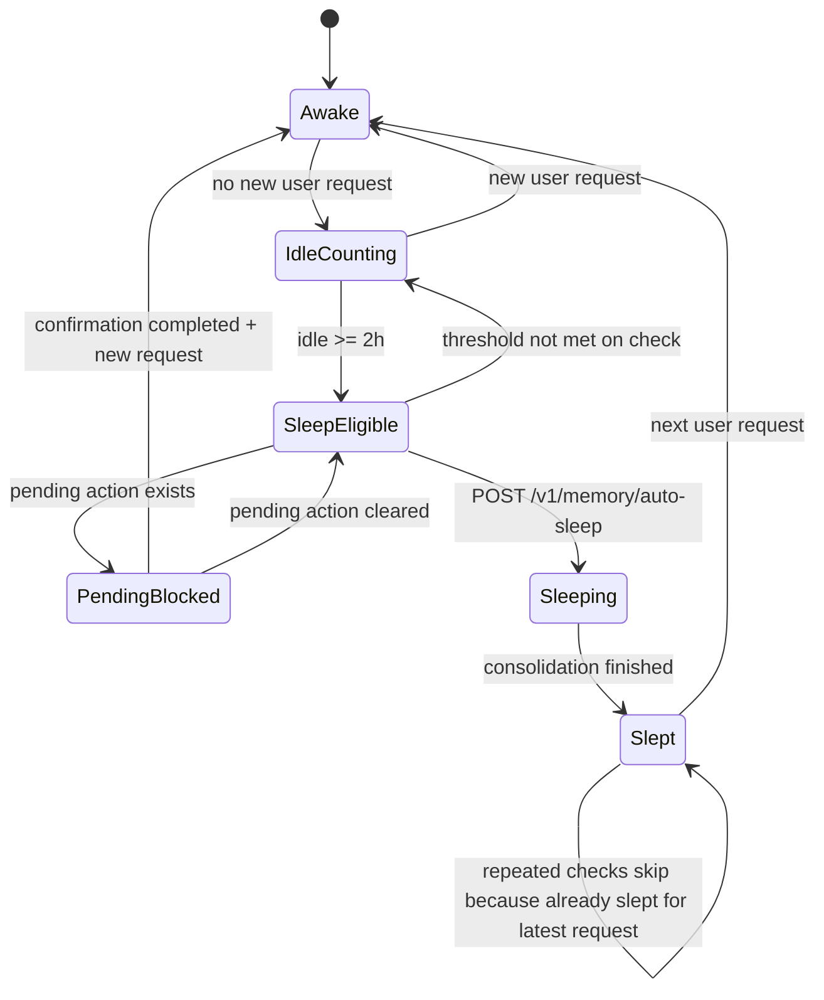

# Mira Memory Sleep And Forgetting Spec

## 1. Goal

本 spec 定义 Mira 当前记忆系统中的「睡眠」与「遗忘」机制，用于在用户长时间未向 Claw 发起 request 时，自动整理上下文、压缩长期记忆、淘汰低价值噪音，并保持后续唤醒时的连续性。

目标不是“定时删除聊天记录”，而是建立一套分层记忆生命周期：

- 近期上下文尽量保真
- 长期记忆只保留高信号事实
- 环境噪音逐步遗忘
- 睡眠作为一次可审计的 consolidation 边界

当前实现以本地优先为原则，主要落在 `OpenClaw/devbox/project/openclaw-ha-blueprint-memory/` 下的 `rokid-bridge-gateway` 记忆链路中。

---

## 2. Design Principles

### 2.1 Local-first

- 原始事件、长期事实、运行态都保存在本地 SQLite
- 睡眠整理不依赖远程状态服务
- 高敏感数据默认不离开本地

### 2.2 Two-phase Memory Processing

参考 OpenAI 在 session memory / context personalization 中推荐的思路，采用两阶段流程：

1. 运行中写入事件
2. 空闲后统一 sleep consolidation

这样比一边对话一边直接改长期记忆更稳，也更容易审计和回滚。

### 2.3 Forgetting Is Selective

遗忘不是随机删内容，而是只淘汰：

- 同日低变化的 ambient idle 噪音
- 多天未被召回、低重要度的环境观测
- 不应进入长期事实层的低信号记录

### 2.4 Sleep Is Triggered By User Inactivity

睡眠以“用户对 Claw 的 request 静默超过 2 小时”为默认触发条件，而不是简单的 wall-clock 时间点。

---

## 3. Current Implementation Directory

```text
OpenClaw/devbox/project/openclaw-ha-blueprint-memory/
├─ services/
│  └─ rokid-bridge-gateway/
│     └─ src/
│        ├─ memory/
│        │  ├─ memoryLedger.ts
│        │  ├─ sqliteMemoryLedger.ts
│        │  ├─ memoryRuntimeState.ts
│        │  ├─ memorySleepConsolidator.ts
│        │  └─ memoryIdleSleepController.ts
│        ├─ routes/
│        │  ├─ memoryIngest.ts
│        │  ├─ memoryContext.ts
│        │  ├─ memorySleep.ts
│        │  └─ memoryAutoSleep.ts
│        ├─ store/
│        │  └─ transientMemory.ts
│        └─ server.ts
├─ scripts/
│  └─ run-memory-idle-sleep-check.sh
└─ docs/
   └─ superpowers/
      └─ plans/
         └─ 2026-03-17-memory-idle-sleep-and-forgetting.md
```

### 3.1 Responsibility Split

- `memoryLedger.ts`
  - 定义事件、长期事实、运行态的统一存取接口
- `sqliteMemoryLedger.ts`
  - SQLite 真实存储实现
- `memoryRuntimeState.ts`
  - 运行态字段定义，例如最近 request 和最近 sleep 批次
- `memorySleepConsolidator.ts`
  - 单日睡眠整理、重要度评分、事实提升、噪音遗忘
- `memoryIdleSleepController.ts`
  - 空闲阈值判断、sleep 触发、阻塞条件处理
- `memoryIngest.ts`
  - 事件写入入口，并识别哪些事件属于用户 request
- `memoryAutoSleep.ts`
  - 自动睡眠 HTTP 入口
- `transientMemory.ts`
  - 瞬时 pending / confirmed action 状态，供 auto-sleep 做阻塞判断
- `server.ts`
  - 把记忆相关路由和 request touch 逻辑接到 runtime
- `run-memory-idle-sleep-check.sh`
  - 外部 cron / launchd / OpenClaw jobs 触发脚本

---

## 4. Memory Layers

### 4.1 Working / Transient Memory

作用：

- 保留最近对话和待确认动作
- 服务于当前上下文和 immediate interaction

来源：

- `memory_events`
- `TransientMemoryStore`

特点：

- 高时效
- 不直接等于长期记忆
- pending action 会阻止 auto-sleep 执行

### 4.2 Episodic Memory

作用：

- 记录发生过什么
- 支持审计、回放、压缩整理

来源：

- `memory_events`

特点：

- 可以在 sleep 中被压缩
- 可以被标记 `forgotten_at`

### 4.3 Long-Term Facts

作用：

- 保留稳定偏好、明确指令、长期事实

来源：

- `memory_long_term_facts`

特点：

- 只接受高信号内容
- 由 sleep consolidation 从事件层提升而来

### 4.4 Runtime State

作用：

- 记录最近一次用户 request
- 记录最近一次 sleep 的执行状态
- 防止同一轮静默被重复 sleep

来源：

- `memory_runtime_state`

---

## 5. State Machine



### 5.1 State Semantics

- `Awake`
  - 最近有用户 request，系统处于活跃交互期
- `IdleCounting`
  - 没有新 request，开始累计静默时长
- `SleepEligible`
  - 静默达到阈值，可执行睡眠
- `PendingBlocked`
  - 有待确认动作，sleep 暂停
- `Sleeping`
  - 正在执行 consolidation / forgetting
- `Slept`
  - 当前这轮 request 已经完成一次 sleep，重复轮询不再重复执行

---

## 6. Table Structure

### 6.1 `memory_events`

用途：

- 保存所有事件级记忆
- 支持 context retrieval
- 作为 sleep consolidation 的输入源

核心字段：

| Field | Type | Meaning |
| --- | --- | --- |
| `event_id` | `TEXT PK` | 事件主键 |
| `event_type` | `TEXT` | 事件类型，如 `chat.user_message`、`ambient.observe` |
| `source_type` | `TEXT` | 来源类型，如 `chat`、`ambient`、`vision` |
| `source_event_id` | `TEXT?` | 上游事件 ID |
| `session_id` | `TEXT?` | 会话 ID |
| `actor_id` | `TEXT?` | 发起者或设备 |
| `target_id` | `TEXT?` | 目标对象 |
| `occurred_at` | `TEXT` | 事件发生时间 |
| `ingested_at` | `TEXT` | 入库时间 |
| `modality` | `TEXT` | `text / image / action / sensor` 等 |
| `scope` | `TEXT` | `direct / ambient / personal` 等 |
| `payload_json` | `TEXT` | 事件载荷 |
| `dedupe_key` | `TEXT UNIQUE` | 幂等键 |
| `privacy_level` | `TEXT` | 隐私等级 |
| `salience_hint` | `REAL` | 初始显著性提示 |
| `retention_class` | `TEXT` | 保留类别 |
| `importance_score` | `REAL?` | 睡眠后写回的重要度 |
| `consolidated_at` | `TEXT?` | 被 consolidation 的时间 |
| `consolidation_batch_id` | `TEXT?` | 睡眠批次 ID |
| `forgotten_at` | `TEXT?` | 被标记遗忘的时间 |

### 6.2 `memory_long_term_facts`

用途：

- 保存长期事实与稳定偏好

核心字段：

| Field | Type | Meaning |
| --- | --- | --- |
| `fact_key` | `TEXT PK` | 事实键 |
| `content` | `TEXT` | 事实正文 |
| `score` | `REAL` | 重要度 / 置信度 |
| `privacy_level` | `TEXT?` | 隐私等级 |
| `source_event_id` | `TEXT?` | 来源事件 |
| `updated_at` | `TEXT` | 更新时间 |

### 6.3 `memory_runtime_state`

用途：

- 保存 idle/sleep 生命周期状态

核心字段：

| Field | Type | Meaning |
| --- | --- | --- |
| `singleton_key` | `INTEGER PK` | 单例行，固定为 `1` |
| `last_user_request_at` | `TEXT?` | 最近一次用户 request 时间 |
| `last_sleep_started_at` | `TEXT?` | 最近一次 sleep 开始时间 |
| `last_sleep_completed_at` | `TEXT?` | 最近一次 sleep 完成时间 |
| `last_sleep_triggered_for_request_at` | `TEXT?` | 最近一次 sleep 所对应的 request 时间 |
| `last_sleep_batch_id` | `TEXT?` | 最近一次 sleep 批次 ID |

---

## 7. Trigger Conditions

### 7.1 What Counts As A User Request

当前实现中，以下情况会刷新 `last_user_request_at`：

1. `POST /v1/observe`
   - 使用 `observation.observedAt`
2. `POST /v1/confirm`
   - 使用当前服务器时间
3. `POST /v1/memory/events`
   - 当 `eventType === "chat.user_message"` 或 `sourceType === "chat"` 时

以下情况不应被视为用户 request：

- ambient observe
- 定时轮询
- 心跳式系统任务
- 纯内部 consolidation

### 7.2 Sleep Trigger

默认条件：

- `now - last_user_request_at >= 2 hours`

当前默认阈值：

- `MIRA_MEMORY_IDLE_THRESHOLD_SECONDS=7200`

### 7.3 Skip Conditions

当以下任一条件成立时，`POST /v1/memory/auto-sleep` 会跳过：

- `no_user_request`
- `pending_confirmation`
- `idle_threshold_not_met`
- `already_slept_for_latest_request`

### 7.4 Forgetting Trigger

当前实现中，以下事件会在 sleep 中被标记遗忘：

1. 同日 low-value ambient idle 噪音
   - `event_type === "ambient.observe"`
   - `activityState === "idle"`
   - `changeScore <= 0.08`
   - `importanceScore < 0.2`

2. 多日低重要度 ambient 噪音
   - `event_type === "ambient.observe"`
   - `importanceScore < 0.3`
   - `ageDays >= 2`

---

## 8. Sleep Consolidation Rules

### 8.1 Importance Scoring

当前评分逻辑包含以下增减项：

- `candidate_long_term` 提升分数
- `chat.user_message` 轻度提升
- `ambient.observe` 降低分数
- `scope === "ambient"` 再次降低分数
- 文本包含 `记住 / remember / 喜欢 / 不喜欢 / 不想 / 不要 / 偏好` 等词时显著提高

### 8.2 Long-Term Promotion

只有满足以下条件的事件才会进入长期事实层：

- 文本存在
- `importanceScore >= 0.7`
- 属于 `candidate_long_term` 或显式偏好/记住表达

### 8.3 Sleep Output

每次 sleep 会写出两类产物：

1. `workspace/memory/YYYY-MM-DD.md`
   - 当日 consolidation 摘要
   - kept memories
   - forgotten noise
   - promoted facts

2. `workspace/MEMORY.md`
   - 当前长期事实总览

---

## 9. HTTP Routes And Responsibilities

### `POST /v1/memory/events`

职责：

- 写入外部事件
- 判断是否属于用户 request
- 在必要时刷新 `last_user_request_at`

### `POST /v1/memory/context`

职责：

- 从 working memory 和 long-term facts 中返回 prompt-ready 片段

### `POST /v1/memory/sleep`

职责：

- 手动触发某一天的 sleep consolidation
- 适合调试、回放、补跑

### `POST /v1/memory/auto-sleep`

职责：

- 检查是否达到 idle threshold
- 检查是否存在 pending action
- 按 request 时间范围找到相关日期
- 逐日执行 sleep consolidation
- 更新 runtime state

---

## 10. Script Responsibilities

### 10.1 `scripts/run-memory-idle-sleep-check.sh`

职责：

- 作为外部调度器的稳定入口
- 向本地 gateway 发起 `POST /v1/memory/auto-sleep`
- 允许通过环境变量调整触发阈值

使用的环境变量：

- `MIRA_MEMORY_GATEWAY_URL`
  - 默认 `http://127.0.0.1:3301`
- `MIRA_MEMORY_IDLE_THRESHOLD_SECONDS`
  - 默认 `7200`

### 10.2 Recommended Scheduling

推荐由 cron / launchd / OpenClaw jobs 每 10 分钟调用一次：

```bash
*/10 * * * * /path/to/run-memory-idle-sleep-check.sh
```

这样可以达到：

- 2 小时后近实时进入 sleep
- 不需要持续常驻高频轮询
- 调度和业务逻辑分离

---

## 11. Pending Confirmation Rule

为了避免在半途中清理掉仍待确认的动作：

- `TransientMemoryStore.hasPendingActions()` 用于向 auto-sleep 暴露阻塞条件
- 一旦确认完成，`saveConfirmed()` 会同时删除对应 pending action

这保证：

- 未确认时不能进入 sleep
- 已确认后不会被永久卡住

---

## 12. Recommended Future Extensions

当前版本已经形成了可运行闭环，但后续仍建议加入：

1. `last_recalled_at`
   - 用于做真正的 memory decay
2. `rehearsal_count`
   - 用于衡量某条记忆被反复召回的频率
3. `forget_stage`
   - 区分 `compressed / dormant / hard_pruned`
4. `routine memory`
   - 从多次 episodic 中自动提炼稳定习惯
5. `sleep batch audit table`
   - 让每次 sleep 的输入、输出、遗忘名单都可查询

---

## 13. Summary

当前 Mira 记忆系统的睡眠/遗忘机制，已经从概念设计进入可实现、可测试、可调度的状态。它的核心不是“自动删历史”，而是：

- 用 `runtime state` 追踪 request 与 sleep 生命周期
- 用 `memory_events` 承接事件级上下文
- 用 `memory_long_term_facts` 保留高信号长期记忆
- 用 `memorySleepConsolidator` 在空闲期做整理和遗忘
- 用 `memoryIdleSleepController` 把“2 小时静默后自动睡眠”真正跑起来

这套结构适合作为 Mira 后续发布版和独立仓库中的正式 memory lifecycle 基础。
