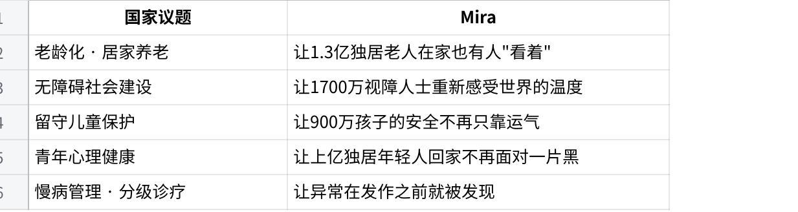

# Mira 项目说明书


**有些关心，不需要开口**

A proactive, low-disturbance AI companion built around real-time sensing, memory, judgment and action.

## 封面

### 一句话领起

Mira 不是一个等待用户提问的聊天框，而是一套**“先感知、再判断、后行动”**的陪伴系统：它借助**AR 眼镜、可穿戴信号、环境上下文与智能家居执行面**，在你最不愿开口、也最需要被照顾的时刻，给出**克制、私密、可解释**的支持。

| Perception | Memory | Judgment | Action |
| --- | --- | --- | --- |
| 眼镜画面、心率、环境线索 | 短期状态与长期偏好记忆 | 先判断“值不值得打扰” | 镜片提示、耳机/手表、家居执行 |

**赛道定位**：生活龙虾｜把日子过好

**文档用途**：面向评委与合作伙伴的正式项目说明

---

## 领起与目录

### 这份说明书想回答的不是“它酷不酷”，而是“它能不能真正照顾人”

今天大量所谓的陪伴式 AI，仍然停留在“**你说，它答**”的范式里；而真正需要帮助的时刻，往往发生在用户**无暇表达、甚至不愿表达**的那几分钟。Mira 的出发点，就是把这段交互空白补上：让系统在被允许的边界内更早一点察觉，更稳一点行动。

| 序 | 章节 | 页码 |
| --- | --- | --- |
| 01 | 为什么今天需要 Mira：从“不会开口的人”讲起 | 03 |
| 02 | Mira 是什么：产品定义、边界与气质 | 04 |
| 03 | 技术原理：感知、记忆、判断与行动的闭环 | 05 |
| 04 | 工程结构：OpenClaw、Rokid 与家居执行面的组合 | 06 |
| 05 | 主 Demo：演讲前主动支持这一条完整闭环 | 07 |
| 06 | 场景扩展：回家照护、家庭守护与实施边界 | 08 |
| 07 | 安全、隐私与社会价值：为什么主动不等于越界 | 09 |
| 08 | 路线图、团队与总结：从 hackathon MVP 走向 companion system | 10 |

### 关键词一｜主动感知

不是定时问候，也不是阈值报警，而是通过**视觉、穿戴与上下文**形成对当下状态的理解。

### 关键词二｜低打扰

Mira 的默认姿态不是“持续说话”，而是**默认沉默、不确定不行动、优先私密输出**。

### 关键词三｜可控执行

真正的陪伴不是一句漂亮文案，而是把理解变成**可审计、可撤销、可限制范围的行动**。

### 阅读建议

如果你只打算快速判断这个项目是否值得投票，请重点看第 5 页和第 7 页：前者回答“**系统到底如何工作**”，后者回答“**本次比赛里究竟做成了什么**”。

---

## 为什么今天需要 Mira

### 问题不在“AI 会不会聊天”，而在“它能不能在你没说话的时候依然理解你”

真正需要被照顾的人，往往也是最不愿意先开口的人。老人会说“挺好的”，孩子会说“没事”，加班到深夜的年轻人会说“我还行”。传统对话式 AI 需要**用户先发起、先组织语言、先承认自己的状态**；而在许多真实生活场景里，这三个条件恰恰同时缺失。

| 用户群体 | 传统 AI 为什么失效 | Mira 的切入点 |
| --- | --- | --- |
| 独居老人 | 出现异常时往往不主动汇报；聊天系统只在被问到时才出现 | 通过行为变化、静默时长、环境状态做**趋势型提醒** |
| 高压工作的年轻人 | 真正疲惫时最不想再打开一个对话框 | 在**回家、上台、熬夜**等关键时刻主动给出最小支持 |
| 儿童守护场景 | 危险发生得快，等待用户或监护人先提问几乎没有意义 | 以**姿态、位置、上下文**做风险检测与私密通知 |
| 视障或行动不便人群 | 环境信息缺失，不便频繁提问或操作设备 | 用**视觉输入 + 语音/震动输出**补足环境可感知性 |

### 为什么这个问题适合“生活龙虾”赛道

Mira 的价值不在炫耀模型能力，而在把抽象的理解转换成**可感受的生活改善**：少一次错过、少一次硬撑、少一次“本该有人注意到”的时刻被浪费。



上图整理了项目原始材料中提出的“国家议题—Mira”对应关系：它提醒我们，Mira 的野心并不只是做一个更讨喜的 AI，而是尝试把“被惦记”这件事重新技术化。

---

## Mira 是什么

### 一句话定义

Mira 是一个基于 OpenClaw 的**主动感受型 AI 伴侣**：它在被授权的设备上接收现实世界信号，在合适时机做判断，并通过**眼镜、耳机、手表或家居设备**给出尽量小、尽量贴身的回应。

### 一句话气质

它的理想状态不是“总在说话”，而是**平时安静、关键时刻出现；知道该做什么，也知道什么时候什么都不做。**

| 范式 | 典型交互 | 局限 |
| --- | --- | --- |
| **你找它** | “我有点难过，你陪我聊聊。” | 用户必须先察觉并说出自己的状态 |
| **它找你** | 定时问候、固定频率推送 | 不知道用户此刻究竟发生了什么 |
| **它懂你（Mira）** | **先观察，再判断，再选择是否行动** | 关键难点转向感知质量、分寸与边界控制 |

### Mira 不是

- 不是全天候喋喋不休的陪聊机器人；
- 不是“看到什么都自动执行”的黑盒 agent；
- 不是以监控为目的的数据收集系统。

### Mira 是

- 一个**把生活信号翻译成照护动作**的 companion system；
- 一个强调**默认沉默、私密输出、最小动作**的陪伴产品；
- 一个把**记忆、感知与执行**放进同一闭环里的现实世界接口。

### 产品原则

**其一，先判断“值不值得打扰”。其二，优先使用最私密、最轻的通道。其三，动作必须可解释、可限制、可撤销。** 这三条原则，决定了 Mira 与普通自动化 agent 的根本差异。

---

## 技术原理：从感知到行动

### 闭环结构

`Perception -> Memory -> Judgment -> Action`

- `Perception`：眼镜画面、心率、环境线索
- `Memory`：短期状态、长期偏好、近期事件
- `Judgment`：是否值得打扰、动作强度、动作通道
- `Action`：镜片提示、耳机/手表、家居执行

### 一个足够解释系统行为的简化判定式

$$
S_t = \alpha V_t + \beta H_t + \gamma C_t + \delta M_t - \lambda R_t
$$

其中，$V_t$ 表示视觉事件显著度，$H_t$ 表示可穿戴侧的生理波动，$C_t$ 表示上下文相关性，$M_t$ 表示记忆检索后的个体匹配程度，$R_t$ 表示动作风险与打扰成本。只有当

$$
S_t > \tau_{\mathrm{act}} \quad \text{且} \quad a_t \in \mathcal{A}_{\mathrm{allow}}
$$

系统才进入行动阶段；否则保持沉默。这一形式并不是为了追求数学花哨，而是为了明确：**主动感知并不意味着自动出手，Mira 的核心是“先判断，再决定是否行动”。**

### 记忆如何发挥作用

记忆层保存的不是一条条孤立日志，而是**“这个人最近经历了什么、通常喜欢什么、什么动作曾经被确认过”**。因此同样是心率升高，对一个准备路演的人意味着鼓励，对一个在健身的人则可能什么都不必做。

### 动作如何保持克制

动作由策略层裁决：**优先私密、优先轻量、优先可撤销。** 先考虑镜片短句、耳机轻声、手表震动；只有在确有必要时，才进入家庭设备控制或外部通知。

### 最简 pipeline

```text
frame + wearable signal + context -> observe -> memory -> policy -> confirm/execute
```

---

## 系统结构与工程落地

### 为什么 Mira 选择 OpenClaw 作为底座

OpenClaw 官方仓库提供了多通道个人 AI assistant、companion apps、device nodes（包括 camera / screen recording / notifications / location）与 skills/workspace 机制，适合作为 Mira 的**控制平面与执行容器**；Rokid 开发文档则提供了设备接入与 SDK / 开放平台能力，使眼镜成为可用的现实世界感知前端。需要特别说明的是：**GitHub 中的文件夹树未来可以重构，但模块逻辑不会变**，无论目录怎么调整，系统本质上仍然由观察入口、记忆层、策略层、确认链路与执行器几部分组成。

| 模块 | 在 Mira 中的职责 | 当前状态 |
| --- | --- | --- |
| Rokid bridge / Observe API | 接收来自眼镜或脚本的观察事件，完成标准化输入 | 已打通 |
| Gateway / control plane | 负责调度、队列与动作路由，是系统的控制中枢 | 已打通 |
| Memory ledger / transient memory | 记录事件、确认、检索上下文，形成可追溯记忆层 | 已打通 |
| Policy layer | 评估 quiet hours、风险级别、recipient scope、是否可外发 | 已打通 |
| Confirm path | 把中高风险动作放入待确认链路，避免黑盒自动化 | 部分实现 |
| Home Assistant executor | 将判断翻译成家庭设备动作与生态控制 | 已打通 |
| 多模态状态融合 | 将视觉、穿戴与记忆一起整合成行动判断 | 可演示 |
| 长期守护型趋势分析 | 面向老人、儿童等长期场景的稳定模型与编排 | 路线图 |

### 工程上最重要的改造

Mira 并没有把 OpenClaw 当作一个“聊天入口”，而是把它当作**现实世界事件的编排器**：从原来的问答响应，扩展为持续接收观察、检索记忆、做策略评估，并把结果路由到更适合的设备通道。

### 为什么这条路可复现

因为它不是纯粹的概念叙事。设备输入、memory ledger、policy 文件、confirm path 与 Home Assistant 执行器都可以拆开验证；也就是说，**Mira 的核心并不是一句 slogan，而是一条可拆分、可调试、可逐步增强的系统路径。**

---

## 主 Demo：演讲前主动支持

### 为什么选这个场景

上台前的紧张，是最容易被忽视、却最适合被技术温柔接住的时刻。用户通常不会在准备登台的最后三十秒专门对 AI 说“我有点慌”，但视觉场景、穿戴信号与近期上下文已经足以构成一条**高价值、低打扰、可解释**的主动支持闭环。

### 端到端流程

1. Rokid 识别公开表达场景。
2. 心率或体态出现紧张信号。
3. 检索近期准备与历史偏好。
4. 策略层判断值不值得打扰。
5. 优先私密通道生成最小支持。
6. 镜片/耳机输出鼓励。

### 示例输出

“放轻松，你肯定可以做到。先深呼吸。你这两天已经准备得很充分了，去把这个舞台拿下来。”

### 这个 demo 证明了什么

- Mira 的价值不在“更会聊”，而在**关键时刻少说一句却更有用**；
- 系统先做的是**要不要行动**的判断，而非默认持续输出；
- 输出优先落在**私密界面**，而不是公共暴露或社交外发。

### 本阶段建议重点跟踪的三个评估指标

**有效触发率**：真正被用户认为“有帮助”的主动触达占比。

**误打扰率**：本不该触发却触发的比例。

**闭环时延**：从事件进入到提示落地的总耗时。

对陪伴型产品而言，模型分数不是终点，**分寸感与体感**才是最重要的产品指标。

---

## 场景扩展与实施边界

### 场景 A｜疲惫工作者的回家时刻

**输入线索**：长时间屏幕注视、全天高压状态、午餐缺失、接近归家时间。

**判断目标**：不是去“劝你休息”，而是判断**是否值得先替你把家变得舒服一点**。

**典型动作**：暖色灯光、加湿器、音乐、香薰或温度调节。

**用户感受**：它什么都没说，但回家这一刻已经被提前照顾好。

### 场景 B｜家庭守护与异常提醒

**输入线索**：久坐不动、步态变化、危险姿态、异常安静、监护对象长期趋势偏移。

**判断目标**：把“说不出口的异常”提早变成**温和而明确的提醒**。

**典型动作**：私密通知、家属提醒、询问型消息、待确认动作。

**用户感受**：Mira 不是替代家人，而是替家人更早一点注意到风险。

| 能力层级 | 本次文档中的处理方式 |
| --- | --- |
| 已实现 / 已验证 | Wearable -> Home Assistant 的动作链路；观察事件进入系统；基础策略层与确认接口；叙事型演讲支持演示。 |
| 部分实现 / 可演示 | 多模态判断拼接、低风险主动提醒、眼镜侧陪伴式输出体验。 |
| 愿景 / 路线图 | 独居老人趋势守护、儿童长期监护、稳定的社交记忆与更完整的回家照护编排。 |

### 为什么要明确写出“边界”

因为一个好的项目说明书不应该把所有场景写成同一语气层级。Mira 当前**已经证明了主动感知和设备执行可以连起来**；更大的守护型场景，是建立在这条主闭环之上的未来扩展，而不是被夸大为已完全交付的现成产品。

---

## 安全、隐私与社会价值

### 主动，不等于越界

Mira 的难点从来不只是“能不能更早察觉”，而是“能不能在边界内察觉”。如果没有规则约束，主动感知会立刻滑向监控与打扰；因此，**Mira 的第一产品能力其实是克制。**

### 当前最重要的五条约束

- 默认沉默，不确定不行动；
- 中高风险外发动作必须进入确认链路；
- 数据处理优先本地，用户拥有暂停与擦除权；
- 家居控制只能在 allowlist / whitelist 范围内执行；
- 对公共社交外发、秘密数据、原始敏感信息保持严格禁止。

### 为什么值得信任

因为它把**policy、confirm、allowlist**写进系统，而不是事后靠口头承诺补救。

### 为什么值得同情它要解决的问题

因为最需要陪伴的人，恰恰最常把“我没事”说出口。

### 为什么这件事有社会价值

它尝试把“有人替你惦记着”变成一种可复制的基础能力，而不只是广告里的温情措辞。


### 这一页的真正结论

Mira 追求的不是“更强的监测”，而是**更有分寸的关怀基础设施**：只在被允许的时候、用被允许的方式、更早一点把帮助送到人身边。

---

## 路线图、团队与总结

### 路线图

1. **Hackathon MVP**：演讲前支持、Wearable -> HA、Observe -> Confirm -> Action
2. **Next 1 Month**：补强 care policy、日志、确认链路与更稳定的设备执行面
3. **3-6 Months**：扩展到回家关怀、独居守护、长期社交记忆与 companion 发布结构

### 团队分工

**Rick**

产品定义、叙事 framing、场景体验、视觉表达与说明书结构。

**Junkai**

后端链路、OpenClaw / Rokid / Home Assistant 接入、安全边界与执行逻辑。

### 评委最后应记住的三点

- Mira 证明的是**care loop**，不是更花哨的聊天文案；
- 本次比赛已经打通**主动感知 + 策略判断 + 设备执行**的主路径；
- 这套系统的价值，来自**克制、私密、可控**，而不是“更激进地自动化”。

### 总结

Mira 想证明的不是“AI 可以更炫”，而是：**AI 可以在合适的时候，更早一点懂你，更稳一点帮你。** 当感知、记忆、判断与执行被放进同一条现实世界闭环里，陪伴才第一次不再只是一句回复，而开始像一种真正发生过的照顾。

资料来源说明：本文档在用户提供的项目说明书、评审 brief、需求文档与展位设计稿基础上重写，并参考 OpenClaw 官方仓库、Rokid 开发文档与 OpenClaw Hackathon 官方活动说明整理而成。
